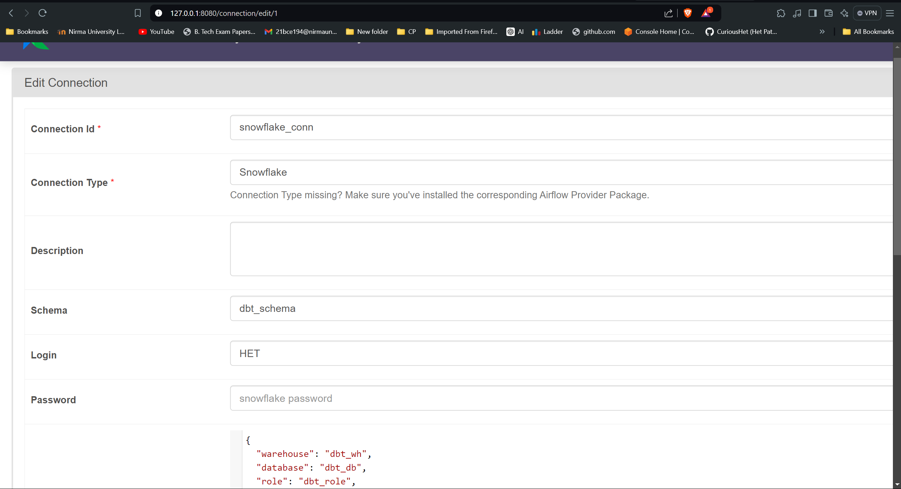
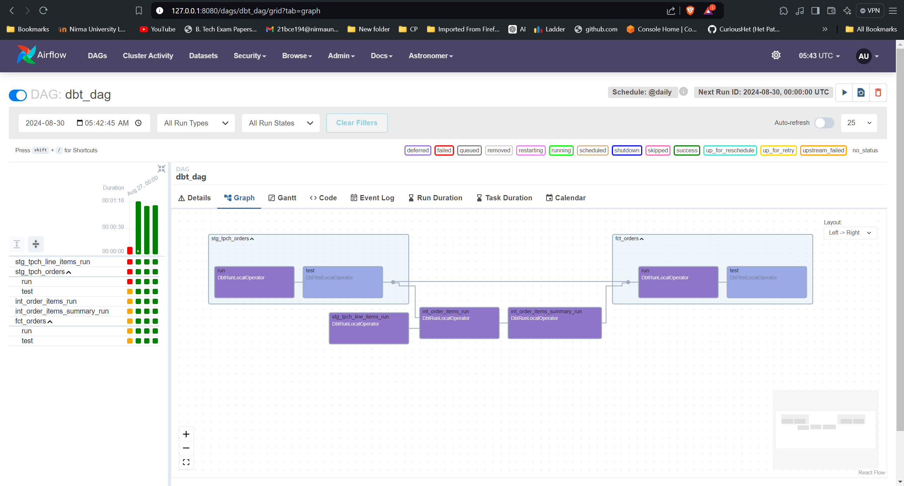
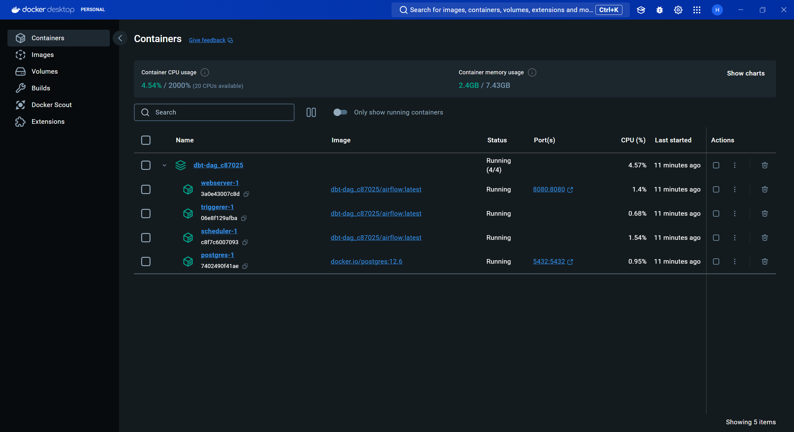

# ETL Data Pipeline with DBT, Snowflake, and Airflow

This project integrates DBT (Data Build Tool), Snowflake, and Airflow to automate and streamline ETL (Extract, Transform, Load) workflows. DBT is used for data transformation, Snowflake acts as the central data warehouse, and Airflow orchestrates the entire pipeline. The project leverages Astronomer Cosmos to deploy DBT models within Airflow.

## Setup Instructions

### DBT Setup

1. **Install DBT and Snowflake Dependencies:**
    ```bash
    pip install dbt-snowflake
    pip install dbt-core
    ```

2. **Initialize the DBT Project:**
    ```bash
    dbt init
    ```

3. **Configure DBT Project:**
    - Modify the `dbt_project.yml` file to fit your project specifications.

4. **Organize DBT Models:**
    - Delete the `example` folder inside `models/`.
    - Create two new folders in `models/`: `staging` and `marts`.

5. **Create and Manage DBT Dependencies:**
    - Create a `packages.yml` file to manage DBT dependencies.
    - Run the following command to install dependencies:
      ```bash
      dbt deps
      ```

6. **Define Staging Models:**
    - Create `staging/tpch_sources.yml` to define your source data.
    - Create `staging/stg_tpch_orders.sql` and `staging/stg_tpch_line_items.sql` for staging the orders and line items data.

7. **Create Data Mart Models:**
    - Create `fct_orders.sql`, `int_order_items_summary.sql`, and `int_order_items.sql` in the `models/marts/` directory.

8. **Run DBT Models:**
    ```bash
    dbt run
    ```
    - This will create the `stg_tpch_orders` and `stg_tpch_line_items` views, and `fct_orders`, `int_order_items_summary`, and `int_order_items` tables in Snowflake.

### Testing and Macros

1. **Create Generic and Singular Tests:**
    - Create `generic_tests.yml` inside the `models/marts/` directory.
    - Add a test SQL file `fct_orders_discount.sql` in the `tests/` directory.

2. **Create Custom Macros:**
    - Add a macro file `pricing.sql` in the `macros/` directory.

### Deploy on Airflow with Astronomer Cosmos

1. **Install Astronomer Cosmos:**
    ```bash
    pip install astro
    ```

2. **Initialize Airflow Project:**
    ```bash
    mkdir dbt-dag
    cd dbt-dag
    astro dev init
    ```

3. **Configure Dockerfile for Airflow:**
    - Add the following code to the `Dockerfile`:
      ```dockerfile
      RUN python -m venv dbt_venv && source dbt_venv/bin/activate && \
          pip install --no-cache-dir dbt-snowflake && deactivate
      ```

4. **Update Airflow Requirements:**
    - Edit `requirements.txt` to include:
      ```plaintext
      astronomer-cosmos
      apache-airflow-providers-snowflake
      ```

5. **Start Airflow:**
    ```bash
    astro dev start
    ```

6. **Setup DBT in Airflow:**
    - Copy the `data_pipeline/` folder into `dbt/` within your Airflow project.
    - Create and edit the `dbt_dag.py` file in the `dags/` directory.

7. **Access Airflow UI:**
    - Open your browser and go to `localhost:8080`.
    - Use the default credentials (Username: `admin`, Password: `admin`).

8. **Add Airflow Connection for Snowflake:**
    - Go to `Admin > Connections` in the Airflow UI.
    - Add a new connection for Snowflake.

    

9. **Run DBT DAG from Airflow:**
    - Trigger the `dbt_dag` from the Airflow UI to execute your DBT models.

    

10. **View Airflow Containers in Docker Desktop:**
    - Open Docker Desktop to view the running Airflow containers.

    

## Conclusion

This setup provides a powerful and automated ETL pipeline that integrates DBT for data transformations, Snowflake for data warehousing, and Airflow for workflow orchestration. By leveraging Astronomer Cosmos, DBT models are seamlessly deployed within Airflow, enabling efficient data processing and analytics.
